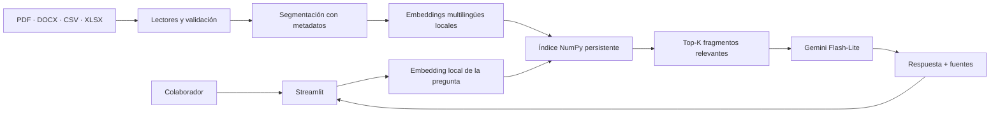

# Pegasus RAG

Asistente de inteligencia artificial que permite consultar documentación empresarial en lenguaje
natural sin abrir manuales. Recupera los fragmentos más relevantes de cinco documentos de
**Santo Pegasus Soluciones**, genera una respuesta sustentada con Gemini y muestra las páginas o
filas que respaldan cada afirmación.

> Proyecto desarrollado para el Challenge Alura + Oracle. El MVP se ejecuta primero de forma local
> y está preparado para desplegarse en una instancia **OCI Compute Always Free**.

## ¿Qué problema resuelve?

Buscar una regla concreta entre decenas de páginas interrumpe el trabajo y facilita respuestas
desactualizadas o inventadas. Pegasus RAG convierte los documentos en una base semántica local:
la pregunta recupera evidencia, Gemini redacta la respuesta y la interfaz conserva las fuentes
para que la persona pueda verificarla.

### Funcionalidades

- Chat en español con historial durante la sesión.
- Cinco manuales técnicos y operativos como base inicial.
- Carga temporal de archivos PDF, DOCX, CSV y XLSX.
- Fuentes con documento, página, sección, hoja o rango de filas.
- Embeddings multilingües e índice vectorial ejecutados localmente.
- Respuesta segura cuando no existe evidencia suficiente.
- Errores diferenciados para cuota, API key, archivos cifrados, corruptos o sin texto.
- Docker Compose con Nginx y health checks para OCI.
- Pruebas automatizadas sin consumir la API de Gemini.

## Arquitectura



El contenido completo nunca se envía al modelo: Gemini recibe la pregunta, un historial reciente
y únicamente los fragmentos recuperados. Las cargas del usuario viven en memoria y desaparecen al
terminar la sesión. El corpus base y el modelo de embeddings se almacenan en volúmenes locales de
la VM.

| Componente | Tecnología | Motivo |
|---|---|---|
| Interfaz | Streamlit | Permite entregar un chat claro sin separar frontend y API. |
| Lectura | PyPDF, python-docx, pandas, openpyxl | Soporte directo de los formatos del Challenge. |
| Segmentación | LangChain Text Splitters | Chunks con solapamiento y metadatos conservados. |
| Embeddings | `paraphrase-multilingual-MiniLM-L12-v2` | Recuperación semántica local en español. |
| Índice | NumPy + similitud coseno | Persistente, portable y sin un servicio facturable. |
| Generación | Gemini mediante `google-genai` | Buena calidad con un nivel gratuito para demos. |
| Infraestructura | Docker, Nginx, OCI Compute | Reproducibilidad, proxy público y health check. |

## Documentos de demostración

El archivo [`data/manifest.json`](data/manifest.json) contiene las URL públicas y los checksums
SHA-256 de:

1. Manual de Onboarding para Nuevos Desarrolladores.
2. Guía Oficial de Ingeniería Back-end.
3. Guía Oficial de Ingeniería Front-end.
4. Protocolo de Respuesta a Incidentes y Post-Mortems.
5. Arquitectura de Microservicios y Mapa de Dominios.

Los PDF descargados y el índice generado se excluyen de Git. El script de preparación verifica
cada checksum antes de usar un documento.

## Ejecución local

### Requisitos

- Python 3.11 o 3.12.
- Aproximadamente 2 GB libres para dependencias y caché del modelo local.
- Una API key del nivel gratuito de [Google AI Studio](https://aistudio.google.com/app/apikey).

### Instalación

```bash
git clone https://github.com/Tecno85/pegasus-rag.git
cd pegasus-rag

python3.11 -m venv .venv
# Bash o Zsh:
source .venv/bin/activate
# Fish:
# source .venv/bin/activate.fish
python -m pip install --upgrade pip
pip install -e ".[dev]"

cp .env.example .env
```

Edita `.env` y añade la key únicamente en tu máquina:

```dotenv
GEMINI_API_KEY=tu_api_key
GEMINI_MODEL=gemini-3.1-flash-lite
```

Mantén desactivada la facturación de Gemini si quieres garantizar que, al agotarse la cuota
gratuita, la aplicación se detenga en lugar de generar cargos. Consulta siempre los
[precios oficiales de Gemini](https://ai.google.dev/gemini-api/docs/pricing).

Prepara la base y ejecuta la aplicación:

```bash
python scripts/rebuild_index.py
streamlit run app.py
```

Abre `http://localhost:8501`. La primera indexación descarga el modelo de embeddings y puede tardar
varios minutos; las siguientes ejecuciones reutilizan la caché y el índice.

### Comandos útiles

```bash
make data       # descarga y verifica los documentos
make index      # reconstruye el índice
make run        # abre Streamlit
make lint       # análisis estático
make test       # pruebas y cobertura
make check      # lint + pruebas
```

La prueba real de Gemini está desactivada por defecto. Para ejecutarla explícitamente:

```bash
env RUN_LIVE_TESTS=1 .venv/bin/python -m pytest -m live tests/test_live_gemini.py -q
```

## Ejemplos de consultas

**Pregunta:** ¿Cuál es la cobertura mínima exigida para aprobar un Code Review?

**Respuesta esperada:** La cobertura mínima de pruebas unitarias es del 80 %. El pipeline valida
ese umbral antes de aprobar el proceso de revisión. Fuentes: Guía Oficial de Ingeniería Back-end,
página 7; Manual de Onboarding, página 13.

**Pregunta:** ¿Cuántas aprobaciones necesita un Pull Request?

**Respuesta esperada:** Todo Pull Request requiere al menos dos aprobaciones de integrantes Senior
o Semi-Senior antes del merge. Fuente: Guía Oficial de Ingeniería Back-end, página 8.

**Pregunta:** ¿Qué tiempo de respuesta tiene un incidente SEV-1?

**Respuesta esperada:** Un incidente SEV-1 tiene un tiempo objetivo de respuesta de 15 minutos y
actualizaciones cada 30 minutos. Fuente: Protocolo de Respuesta a Incidentes, página 4.

También puedes preguntar:

- ¿Qué requisitos WCAG debe cumplir el frontend?
- ¿Cómo se propaga el Trace ID entre los microservicios?
- ¿Cuál es el proceso para solicitar accesos durante el onboarding?
- ¿Qué servicios consumen eventos desde SQS?

Si preguntas algo que no aparece en los documentos, el agente debe responder: “No encontré
información suficiente en la base documental para responder”.

## Uso con documentos propios

1. Abre **Añadir documentos a esta sesión** en la barra lateral.
2. Selecciona hasta cinco archivos PDF, DOCX, CSV o XLSX de máximo 10 MB cada uno.
3. Pulsa **Procesar documentos**.
4. Haz preguntas normalmente; la recuperación combinará la base inicial y tus archivos.
5. Usa **Eliminar documentos temporales** para retirarlos antes de terminar la sesión.

Los PDF escaneados sin una capa de texto requieren OCR y no están soportados en este MVP. No subas
datos confidenciales al despliegue público: los fragmentos recuperados son enviados a Gemini y el
nivel gratuito puede usar contenido para mejorar productos de Google.

## Docker

```bash
cp .env.example .env
# Añade GEMINI_API_KEY a .env
docker compose up --build -d
docker compose ps
curl http://localhost/_stcore/health
```

La aplicación no publica el puerto 8501. Nginx es el único punto de entrada por el puerto 80 y
mantiene la conexión WebSocket de Streamlit. El primer inicio construye automáticamente el índice.

Para revisar los logs:

```bash
docker compose logs -f app
```

## Despliegue en OCI Compute Always Free

### 1. Crear la instancia

1. En OCI, crea una VM con Ubuntu 22.04 o 24.04.
2. Selecciona una forma Ampere A1 elegible para Always Free; 4 OCPU y 24 GB de RAM ofrecen margen
   suficiente para el modelo local. La capacidad depende de la región y de la cuenta.
3. Usa una subred pública, asigna una IP pública y guarda la llave SSH.
4. En la lista de seguridad o NSG habilita TCP 80 desde Internet y TCP 22 solo desde tu IP.
5. No crees servicios de IA, bases de datos o balanceadores facturables.

Verifica los límites vigentes en la documentación de
[OCI Always Free](https://docs.oracle.com/en-us/iaas/Content/FreeTier/freetier_topic-Always_Free_Resources.htm).

### 2. Preparar Docker

Conéctate por SSH y ejecuta:

```bash
sudo apt-get update
sudo apt-get install -y docker.io docker-compose-v2 git
sudo systemctl enable --now docker
sudo usermod -aG docker "$USER"
```

Cierra la sesión SSH y entra nuevamente para aplicar el grupo `docker`.

### 3. Publicar la aplicación

```bash
git clone https://github.com/Tecno85/pegasus-rag.git
cd pegasus-rag
cp .env.example .env
nano .env
docker compose up --build -d
docker compose ps
curl http://localhost/_stcore/health
```

Accede mediante `http://IP_PUBLICA`. La API key queda solo en `.env` dentro de la VM y nunca se
incluye en la imagen o el repositorio.

### 4. Evidencia del Challenge

- **Aplicación pública:** pendiente de completar después de aprovisionar la VM.
- **Captura en OCI:** guardar en `docs/images/pegasus-rag-oci.png` y añadirla aquí tras el deploy.
- Probar desde una red externa una pregunta, una cita, una carga temporal y el health check.

## Estructura principal

```text
src/pegasus_rag/   configuración, lectores, embeddings, índice y servicio RAG
app.py             interfaz y estado de sesión de Streamlit
data/manifest.json fuentes reproducibles con checksums
scripts/           descarga, indexación e inicio del contenedor
tests/             pruebas unitarias, integración simulada y smoke test opcional
deploy/nginx/      reverse proxy para OCI
```

## Seguridad, costos y limitaciones

- No se versionan secrets, documentos descargados, índices ni cargas de usuarios.
- Los documentos temporales no sobreviven al cierre de la sesión o reinicio del proceso.
- La aplicación no tiene autenticación porque es una demostración pública del Challenge.
- Gemini gratuito tiene límites y puede dejar de responder al agotar la cuota; no hay fallback
  automático a un servicio pago.
- El índice NumPy está diseñado para un corpus pequeño o mediano, no para millones de documentos.
- No se incluyen OCR, entrenamiento de modelos, analítica, almacenamiento multiusuario ni TLS. Para
  un uso empresarial real se necesitarían autenticación, cifrado, políticas de retención y HTTPS.

## Licencia

El código se distribuye bajo la licencia MIT. Los documentos de demostración conservan las
condiciones de sus respectivos autores y se descargan desde los enlaces suministrados por el
Challenge.
